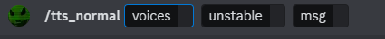

# TTSBot
### Description  
This project is a Discord-based Text-to-Speech (TTS) bot which allows users to play AI-generated speech within a voice channel using simple text commands.  

This project leverages several APIs and development kits:  
ElevenLabs API
- https://api.elevenlabs.io/docs
- https://github.com/elevenlabs/elevenlabs-python

Microsoft Azure Speech SDK
- https://learn.microsoft.com/en-us/azure/cognitive-services/speech-service/speech-sdk
- https://learn.microsoft.com/en-us/azure/cognitive-services/speech-service/speech-synthesis-markup-voice

---
### Using TTSBot
Registration (DEPRECATED) :  
- Each user must first register their ElevenLabs API key with TTSBot by sending a direct message to TTSBot containing only their ElevenLabs API key (Create an ElevenLabs account at https://beta.elevenlabs.io/sign-up &rarr; Go to https://beta.elevenlabs.io/ &rarr; Click on top right profile picture &rarr; ```Profile``` &rarr; ```API Key```)
- This is necessary since ElevenLabs only provides a limited number of characters per user for speech generation  

TTS:  
Speech is generated through the slash command ```/tts_normal```

- The ```voices``` field lets the user select from the available ElevenLabs voices
- The ```unstable``` field lets the user choose whether to make the speech "normal" (```false```) or unstable/wacky/unpredictable (```true```)
- The ```msg``` field is where the user enters the actual content to be spoken by TTSBot

- Once each field is filled, sending the ```/tts_normal``` command will move TTSBot into the user's voice channel, where TTSBot will begin speaking
- After speaking, TTSBot will remain in the voice channel

Misc - Leave:  
The user may evict TTSBot from its voice channel through the slash command ```/leave_voice``` 


---
### Hosting TTSBot
First Time Setup:
- Install basic Python requirements ```pip install -r requirements.txt```
- Install ffmpeg to environment ```apt install ffmpeg```
- Rename the file ```.env_example``` to ```.env``` after adding your bot's discord token and adding the name of your guild   

To Run:
- ``` python3 client.py ```

---
### Development Roadmap
Short-Term ToDo:
- Reorganize Util and Speech classes for comprehensibility
- Modify FFmpegPCMAudio (in tts_normal, etc.) to use bitstream instead of wav
- Modify how user info (such as ElevenLabs keys) is stored
- Add logging https://discordpy.readthedocs.io/en/latest/logging.html
- Modify how ElevenLabs API keys are registered
- Implement robust error handling
- Conduct comprehensive unit tests
- Generally reorganize dependancy handling and code format to follow some kind of standard (lol)

Long-Term ToDo:
- Implement "One-shot" voice cloning using ElevenLabs API
- Transition from ElevenLabs to a locally-run model
- Implement "Deep" voice cloning with local training
- Control TTSBot through voice commands
- Distinguish between different voices (e.g. if Bill asks TTSBot for something, TTSBot will do that thing using Bill's stored info)